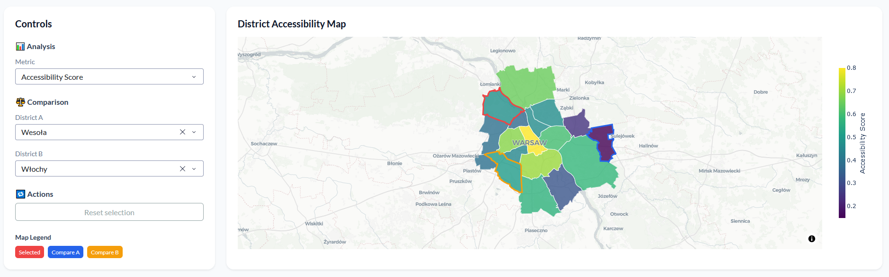
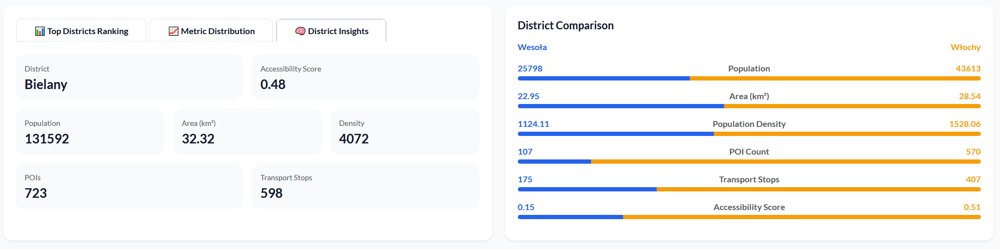
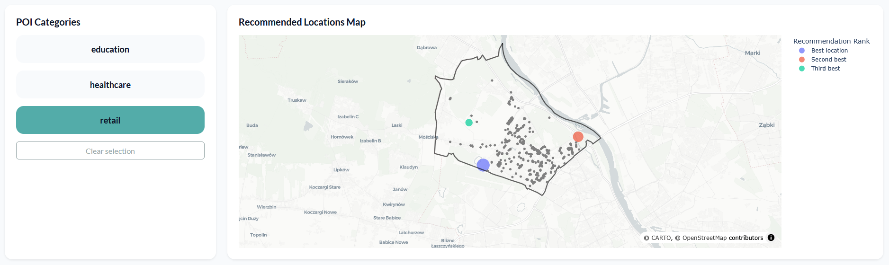

# Geo Accessibility Dashboard

**Geospatial Data Pipeline & Interactive Dashboard for Urban Accessibility Analysis in Warsaw**

**👉[Live Demo](https://geo-accessibility.onrender.com/)**\
<small>(First load may take a while due to Render's resource management.)</small>

A complete end-to-end data engineering project focused on acquiring, processing, and visualising geospatial data for urban accessibility insights.

---

## App Preview

### Controls Panel + Districts Map


### Analytics Section


### Location Recommendation Section

---

## Project Highlights

- Robust geospatial ETL pipeline (raw data → cleaned → database)
- Modern interactive analytics dashboard built with **Plotly Dash**
- Deployed using **Supabase** (PostgreSQL + PostGIS) and **Render**
- Docker available as an optional local development setup
- Real-world case study on Warsaw, Poland

---

## Tech Stack

- **Language**: Python 3
- **Data Processing**: Pandas, GeoPandas, NumPy
- **Database**: PostgreSQL + PostGIS
- **Dashboard**: Plotly Dash + Dash Bootstrap Components
- **Visualisation**: Plotly Graph Objects + Plotly Express
- **Deployment**: Render (web app) + Supabase (database)
- **Local Alternative**: Docker

---

## Repository Structure

```bash
geo-accessibility/
├── app/                    # Plotly Dash web application
│   ├── dashboard.py
│   ├── data_loader.py
│   ├── layout.py
│   └── __init__.py
├── configs/                # Configuration (YAML)
├── data/
│   └── source/             # Raw datasets (GeoJSON, CSV)
├── docker/                 # Docker setup
├── docs/                   # Screenshots
├── notebooks/              # Data validation scripts
├── scripts/                # Pipeline orchestration scripts
├── src/                    # Core modules (ingestion, processing, db, utils...)
├── .env.docker
├── Dockerfile              # Docker setup
├── run_app.bat             # Windows script for Docker build
├── requirements.txt
└── README.md
```

---

## Local setup using Docker

### 1. Clone the repository
```bash
git clone https://github.com/shmeetoo/geo-accessibility.git
cd geo-accessibility
```

### 2. Start application
Run script (Windows):
```bash
run_app.bat
```
Or manually (macOS/Linux): 
```bash
docker compose --env-file .env.docker -f docker/docker-compose.yml up -d 
```

### 3. Open dashboard
Once Docker build and data pipeline process are completed, the app will be available at:
```bash
http://localhost:8050
```

---

## Data Pipeline

**Sources**
- Official Warsaw district boundaries (GeoJSON)
- Points of Interest (POIs), public transport stops and land use from OpenStreetMap via OSMnx
- District population data (2019)

**Processing steps:**
- Geometry validation & cleaning
- Reprojection to EPSG:4326
- District name harmonization
- POI categorization
- Loading to Supabase (PostGIS) with spatial indexes

---

## What This Project Demonstrates

- End-to-end geospatial data engineering workflow
- Working with spatial databases (PostGIS)
- Building production-grade interactive dashboards with Plotly Dash
- Cloud deployment (Supabase + Render)
- Clean, modular code architecture
- Reproducible data pipelines
